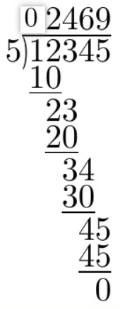

### 大数加法

其中 $t$ 为进位，初始化为0，并在每一轮更新 $t$ 的值

[leetcode链接](https://leetcode.cn/problems/add-to-array-form-of-integer/description/)

### 大数减法

其中 $t$ 为进位，初始化为0，并在每一轮更新 $t$ 的值.

### 大数乘法

这里的乘法是指一个大数乘以另一个较小的数，如果是两个大数相乘，比如：

则可以转换为上面的大数乘小数的形式：

这里的加法就可以用到上面的大数加法来解决

[leetcode链接](https://leetcode.cn/problems/multiply-strings/description/)

### 大数除法
从高位到低位，当前位除以除数，得到商和余数，余数乘以10再加上下一位，继续下一位的除法。

