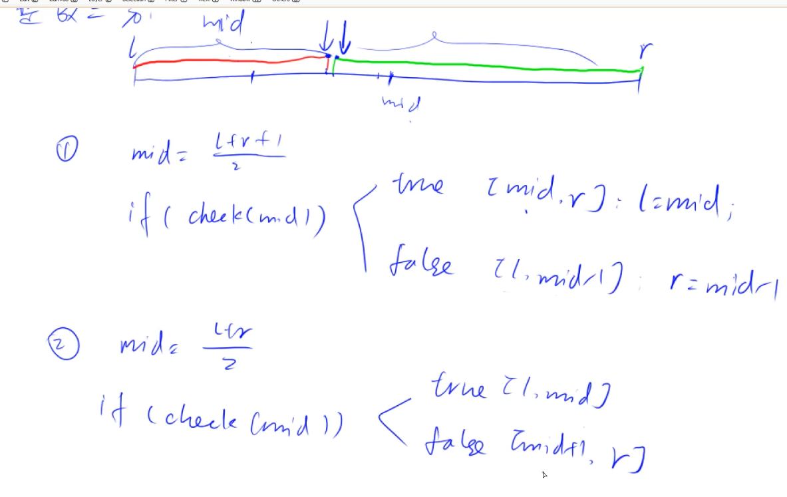
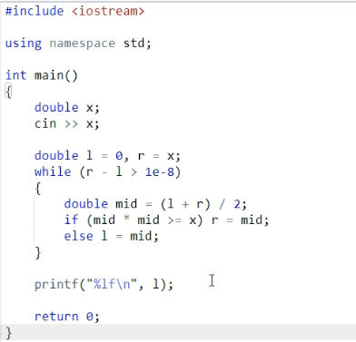

### 整数二分

两个模板,针对的问题分别是找首个和最后一个.
一个有序的数组:

1. 找一个满足性质1(红色)的最后一个位置.
2. 找一个满足性质2(绿色)的第一个位置.

注意为什么第一个模板mid=(l+r+1)/2? 因为考虑l+1=r的情况,如果check通过,mid=(l+r)/2,则下一次循环l=mid=(l+l+1)/2=l,l还是没变,陷入了死循环.
所以需要+1.归根到底还是因为整数除法是向下取整的.

### 浮点数二分
比如求平方根,这个比整数二分更简单,因为不需要考虑边界情况,当精度达到某个范围即可认为找到了答案:

